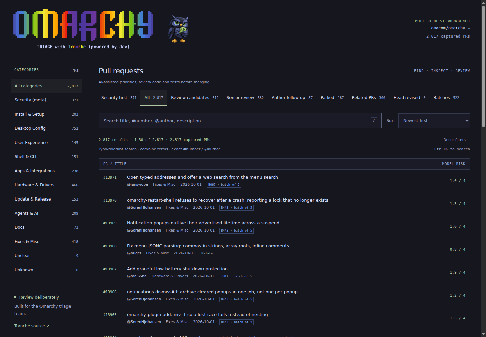
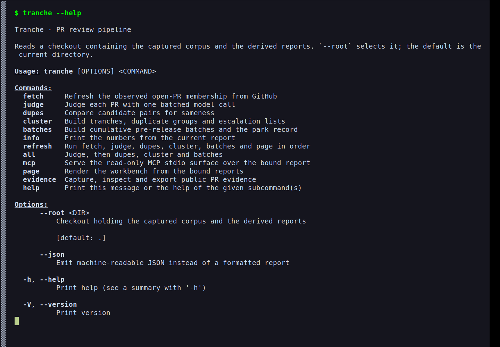

# Tranche


**Tranche, the backlog keeper.** A configurable PR triage tool for public GitHub
repositories. It spots likely duplicates and gathers changes into reviewable
batches. Jev supplies the judgments; humans make the merge call.

Each deployment has a `tranche.json` contract that selects the repository, model
alias, question wording, category taxonomy and display labels. The same binary
runs each deployment. Omarchy is the included demo use case, with a captured
corpus and published report; its review policy is an example, not a requirement
for using Tranche.

MIT licensed (see [LICENSE](LICENSE)); Tranche reads public repositories only and
never includes credentials in its reports.

**Omarchy demo report:** <https://vdistefano.studio/Tranche/>

## Screenshots

The published workbench: searchable PRs, review queues and model risk hints.



The native CLI: pipeline commands, evidence tools and the complementary MCP server.



## Why Omarchy is the demo

Tranche grew out of the Omarchy PR backlog. DHH's
[call for a human triage team](https://x.com/dhh/status/2098755120540393908)
described concrete work: consolidate duplicates, prepare fixes for review, and
bring changes forward in finished form. That is a useful test of a triage tool:
the output has to help maintainers decide what to read next and what needs more
work, rather than merely assign labels.

Omarchy exercises several problems other repositories also face:

- A large backlog makes repeated manual sorting expensive. Incremental captures
  and bound judgments let Tranche reuse work when the evidence and policy have
  not changed.
- Contributors can propose competing fixes for the same problem. Candidate
  pairs and duplicate groups give reviewers a starting point for comparing the
  implementations; similar wording alone never proves equivalence.
- Changes span installation, desktop configuration, shell tools, applications
  and hardware support. A repository-specific taxonomy is more useful here than
  one universal set of labels. Omarchy's categories live in its deployment
  contract, and another repository can supply its own.
- A documentation edit and a change to permissions or boot behavior need
  different review effort. Risk hints and the security queue help route that
  attention, but do not establish that a patch is safe.
- Product taste belongs to maintainers. Omarchy's contract has a
  `user-experience` category so those proposals remain visible as a distinct
  area; categorization does not authorize a model to decide the project's
  defaults or design direction.
- The demo is inspectable. The published workbench exposes the review queues,
  and a committed slice of the captured corpus lets regression tests rebuild
  reports without buying a model pass. Offline CLI and MCP commands read those
  same bound reports. The full capture is local data, not bundled with the
  binary or guaranteed to be present in a fresh clone.

The demo shows the whole path from captured PRs to a human review queue. It also
makes the limits visible: Tranche judges descriptions and diff statistics,
not patch correctness. Reviewers still need to read the diffs, check CI and test
the proposed result.

The included `tranche.json`, report data and screenshots describe Omarchy. For
another public GitHub repository, create a separate deployment root with
`tranche init OWNER/REPO` and edit its starter policy before making model calls.
Tranche currently uses [TypeSafe](https://docs.typesafe.ai)'s System One model
**Jev**; configurable repository policy does not imply interchangeable model
providers or support for other forges.

## What Tranche does

- **Fetches** the configured repository's open PRs into a local snapshot, through
  `gh`, so the credential never touches a command line.
- **Judges** each PR with one batched Jev call: what area it touches, how risky
  it is, whether it is a fix, how finished it looks, how much review effort it
  needs, whether it smells security-relevant, and whether it admits to
  duplicating something.
- **Finds likely duplicate groups** by comparing candidate pairs — title and
  body similarity plus literal cross-references between PRs.
- **Batches** those groups into merge units of up to five PRs, security first.
  Each batch carries a ready-to-paste reviewer prompt.
- **Publishes** everything: `out/` for machines and agents, and a browsable HTML
  workbench for people.

It is a discovery and prioritization pass. It never merges, never closes, and
its "duplicates" are model suggestions, not verified facts. Maintainers decide
what happens to a PR — always.

## Install

You need a Rust toolchain, and the [`gh` CLI](https://cli.github.com) signed in
for the fetch stage. A Jev API key is needed only for `judge` and `dupes`.

```bash
git clone https://github.com/blackopsrepl/Tranche && cd Tranche
cargo install --path crates/tranche-cli --locked
```

The binary is self-contained: no interpreter, no daemon, no database, no service
to start. It reads a checkout containing the captured corpus and the reports
derived from it. Run it from that checkout, or point at one from anywhere:

```bash
tranche --root /path/to/Tranche cluster
```

`--root` defaults to the current directory. `--help` at any level shows the
flags that exist.

## Quick start

### Run the Omarchy demo

The commands below use this checkout's Omarchy contract. `fetch` captures current
membership; `judge` and `dupes` can incur API charges. Browsing the published
[demo report](https://vdistefano.studio/Tranche/) requires no setup.

```bash
# Give the model stages a key. Either source works; the env var wins.
echo "apikey_..." > ~/Documents/jevapi.txt
export TYPESAFE_API_KEY=apikey_...

tranche fetch                 # capture open-PR membership (needs gh)
tranche judge --resume        # one batched model call per unjudged PR
tranche dupes                 # compare candidate pairs
tranche cluster               # build clusters, dupes, tranches.md, summary
tranche batches               # pack batches, write the park record
tranche page                  # render the workbench
tranche page --export-json --export-xlsx # optionally write standalone exports
```

`tranche refresh` runs those stages in that fixed order and reuses whatever its
caches still support. `tranche refresh --dry-run` reports what it would do
without spending a model call.

Every stage is safe to re-run. `cluster` and `batches` are pure functions of the
stored corpus — they call no model and touch no network.

### Use another repository

Keep its data separate from the Omarchy demo. From the Tranche source checkout:

```bash
mkdir ../my-triage
tranche --root ../my-triage init OWNER/REPO
# Edit ../my-triage/tranche.json before the first model pass.
tranche --root ../my-triage fetch
tranche --root ../my-triage judge --resume
tranche --root ../my-triage dupes
tranche --root ../my-triage cluster
tranche --root ../my-triage batches
```

Replace `OWNER/REPO` with the public GitHub repository you want to review. The
starter uses generic categories such as `fix`, `feature`, `docs` and `chore`.
Adjust their criteria and question wording to the repository's review standards;
keep the engine's question names, answer types and score ranges. This is a
configurable triage workflow, not an arbitrary questionnaire engine.

`init` refuses an existing contract unless you pass `--force`. Changing the
repository, model alias or question wording changes cache bindings. Edit before
judging whenever possible; later changes can require another paid model pass.
Display labels and titles do not enter model-call cache keys.

Page rendering currently requires deployment-local resources beyond the
contract. Copy the template and browser assets from this checkout before
rendering:

```bash
mkdir -p ../my-triage/page ../my-triage/docs/assets
cp page/template.html ../my-triage/page/
cp -R docs/assets/. ../my-triage/docs/assets/
tranche --root ../my-triage page
```

The assets include Tranche branding and demo screenshots; they are not the
repository's review policy. `init` currently writes only `tranche.json`, so a
new deployment cannot render a page from the installed binary alone.

## Checking a report before you trust it

The report is bound: it records a digest of the inputs it was built from, and the
gate refuses a report whose binding no longer matches. Ask what you are looking
at rather than assuming:

```bash
tranche info                  # the counts and digests of the current report
tranche info --json           # the same, for a script
tranche cluster --json        # rebuild and print the summary as JSON
```

`summary.json` carries `report_binding` and the digests of every output. If a
reader and a writer disagree about `report_binding`, they are looking at
different observations.

## Everyday commands

```bash
tranche fetch [--transport gh|urllib|curl]   # re-capture open-PR membership
tranche judge [--resume] [--limit N]         # model pass; resume reuses matches
tranche dupes [--max-pairs N]                # candidate-pair comparisons
tranche cluster [--allow-unbound]            # offline; no model, no network
tranche batches                              # offline; packs batches from the report
tranche info                                 # read the current report's numbers
tranche page [--export-json] [--export-xlsx]  # render, with optional standalone exports
tranche refresh [--max-pairs N] [--no-page] [--dry-run]
tranche all                                  # judge --resume, dupes, cluster, batches
```

Cost intuition: a refresh with nothing new spends **zero** model calls. A full
corpus re-judge is ~2,800 calls (~5M input tokens) and only happens when the
question policy or the model changes, which is rare and deliberate. A dupe pass
over all candidate pairs is a few hundred thousand tokens. The dry-run tells you
which situation you are in before you commit to it.

## What Jev is asked (one batched call per PR)

The engine reads the seven answer shapes below. Question wording and category
choices come from each deployment's contract; the category list shown here is
Omarchy's demo taxonomy, not the generic starter's.

| Question | Type | Meaning |
|---|---|---|
| `category` | Choice | install-setup / desktop-config / user-experience / shell-cli / apps-integrations / hardware-drivers / update-release / agents-ai / docs / fix-misc / unclear |
| `risk` | Score | 0 text-only → 4 could break existing installs |
| `is_fix` | Noul | P(bug fix, not feature/taste change) |
| `dupe_signal` | Noul | P(title/body admits duplication or supersedence) |
| `finished_form` | Score | 0 no description → 3 what+why+QA evidence |
| `review_effort` | Score | 0 trivial → 3 substantial |
| `security_flag` | Noul | P(touches secrets/sudo/remote-code/network exposure) |

A **Noul** is a probability; a **Score** is an integer band. A question the model
answers unusably becomes `null` and is listed in `normalization_errors` — it is
never coerced to zero, because an unknown and a measured low are different facts.

## How the evidence binds

Judgments bind the fields they were based on — title, body, head SHA, labels,
draft state, diffstat, timestamps, the exact question set and the model — not the
whole GitHub response envelope, whose repository-wide counters change on
unrelated events. A re-fetch that changed nothing reuses everything; a changed
description re-asks. The same discipline applies to pair verdicts.

`fetch` commits exact observed membership atomically: a failed capture leaves the
previous snapshot untouched. Pagination is not a point-in-time snapshot, so a
captured PR may have changed by the time you read it.

Published historical judgments have no bindings and cannot be retrofitted;
`judge --resume` re-evaluates them at API cost. `--limit` (judge) and
`--max-pairs` (dupes) bound work per pass. For offline inspection only,
`cluster --allow-unbound` includes legacy judgments with warnings; they never
enter review candidates or batches.

## Outputs

Report artifacts land in `out/` under the deployment root; the workbench lands
in `docs/`. This repository tracks the Omarchy demo's report artifacts. Other
deployments decide how to store and publish their own data.

| File | What it is |
|---|---|
| `tranches.md` | The human report: review candidates, relationship diagnostics, escalation and follow-up leads, the batch plan. |
| `clusters.json` | Judgments grouped by category × risk band (`low`, `core`, `danger`, `unknown`), with source digests and URLs. |
| `dupes.json` | `confirmed_groups` (model-consistent candidates, **not** verified duplicates), `review_groups`, `uncertain_pairs`. |
| `batches.json` | Merge batches bound to the `dupes.json` digest. |
| `parked.json` | PRs held out of batches, each with its named unblock path. |
| `summary.json` | Counts, token usage, report binding and output digests. |
| `docs/index.html`, `docs/data/workbench.json` | The rendered workbench and its private client payload. |
| `docs/data/report.json` | Optional versioned standalone JSON export; see [the export schema](docs/PAGE_EXPORT.md). |
| `docs/data/report.xlsx` | Optional filterable Excel export. |

Review-candidate thresholds: risk ≤ 1.5, finished_form ≥ 1.8, is_fix ≥ 0.6,
security_flag < 0.5, current judgment, not a draft, outside a candidate group. A
missing field can never qualify a PR.

## Security meta-category (top priority)

Security is a cross-cutting classification over **all** PRs, not a category slot:
every PR whose `security_flag` reaches 0.5 joins a `security-review` set that
outranks every category — the first section of `tranches.md`, the first queue of
the workbench. Review these before any batch. Membership never replaces a PR's
own category, and an unknown probability is never flagged.

## Batches

A **batch is a group of PRs to merge into ONE pull request**: exactly the
model-consistent `same_change` groups, disjoint by construction. Groups with
contradictory or untested internal evidence, and uncertain pairs, are excluded on
purpose — being unbatched is the honest state for them, and `parked.json` records
why each held-out PR is there.

Batches are ordered security-first, then by risk band, then by activity.
`updated_at` on this repository is continuous bot churn, so the activity signal
is the head SHA bound at judgment time: a revised head means the author pushed
since. Batches are a plan, never a verified-safe merge.

## Development

```bash
make test          # cargo tests over the workspace
make check         # tests plus format, clippy and whitespace
make cli-install   # build and install the binary from this checkout
```

Three conventions hold across the codebase:
- No source file reaches **500 lines** for future additions and changes; the
  existing module layout stays as it is.
- `mod.rs` and `lib.rs` contain module declarations and re-exports only, no code.
- Tests live only in `tests/`, named for the outcome they protect rather than the
  module they exercise.

[docs/ARCHITECTURE.md](docs/ARCHITECTURE.md) explains the layout and what the
on-disk formats guarantee.

CI runs the same gate on every push and pull request, on GitHub and on the local
Forgejo. A release carries the built binary, not just a tag.

## Versioned releases

One coherent iteration produces one release tag. `VERSION`, the Cargo workspace
version, the two Tranche entries in `Cargo.lock`, and `CHANGELOG.md` are
owned by [commit-and-tag-version](https://github.com/absolute-version/commit-and-tag-version)
(`.versionrc.js`); never edit them by hand.

```bash
git pull --ff-only origin master
make release-dry-run        # offline checks, clean-master gate, preview; no writes
make release               # compute the bump, update all versions, commit + tag
git push --follow-tags origin master
git push --follow-tags forgejo master
```

The pushed `v*` tag triggers the `release` workflow
(`.github/workflows/release.yml`), which re-runs the gate on the tagged commit,
builds the release binary for `x86_64-unknown-linux-gnu`, confirms the binary
reports the tagged version, packages it with a checksum, and publishes the
release from that tag's own `CHANGELOG.md` section — so notes can never drift
from the changelog. An existing tag can be published retroactively:

```bash
gh workflow run release --ref master -f tag=v0.8.1
```

Verify with `gh release list` — the releases page, not the tag list, is what
people see. Releases version the code, not the freshness or correctness of
historical model judgments.

The Forgejo mirror at <http://vigilance:3002/blackopsrepl/Tranche> has its own
tag-triggered workflow (`.forgejo/workflows/release.yml`). Publish the same master
commit and tag to both remotes. Verify the Forgejo release page as well: each
release must contain the Linux archive and its SHA-256 checksum, and the packaged
binary must report the tag's version. `fork` is a contributor's repository, not a
publication target.

## The MCP surface

`tranche mcp` serves a read-only, model-free MCP server over stdio — the standard
transport, so any MCP client can spawn it:

```json
{"mcpServers": {"tranche": {"command": "tranche", "args": ["--root", "/path/to/checkout", "mcp"]}}}
```

This is **not a second implementation**. The MCP surface and the CLI commands read
the same bound report through the same validation gates, in the same binary. An
agent asking over MCP and a person asking `tranche info` cannot be told different
stories by one checkout, and the two can never drift apart in a release, because
there is only one thing to release.

Six tools:

| Tool | Answers |
|---|---|
| `surface` | coverage, queues, category counts, batch overview |
| `query` | security-first PR search with exact filters and pagination |
| `pick` | one batch's PRs with the unchanged reviewer prompt |
| `next_prompt` | the next batch in report order |
| `related` | one PR's dupe evidence: groups, pairs, conflicts, missing comparisons |
| `digests` | the report binding and output checksums a reader quotes |

Every answer carries the report's binding and a disclaimer. Model suggestions are
not merge approval; digests prove integrity, not authenticity. Responses are
capped at 1 MiB, pagination at 100, and unknown tools are refused with `-32602`.
The server re-reads and re-validates the report on every call and fingerprints the
input files before and after a read, so a report changing mid-request is refused
rather than half-served.

## FAQ

**Does Tranche merge or close anything?**
No. The pipeline is read-only toward GitHub. Nothing claims, reserves or approves
work.

**What does "duplicate" mean here?**
A Jev judgment that two PRs propose the same underlying change, with the
model-consistency checks described above. It is a merge-review lead, not a
verified duplicate — always compare sources before closing anything, and note
that PR age never selects a survivor.

**Why is a risk score wrong?**
Because it judges `title + body + diffstat` only. It never reads patches, test
results or CI. Treat scores as sorting hints for human review, and treat `unknown`
(null) as unknown — the pipeline never fakes a zero.

**Do I need a Jev key to try this?**
Not for `fetch`, `cluster`, `batches`, `page`, `info`, `mcp` or the tests. Only
`judge` and `dupes` call the model.

**Which commands run offline?**
`cluster`, `batches`, `info` and `page`. `fetch` needs `gh` and the network;
`judge` and `dupes` need the model. `refresh` fetches before running the pipeline;
`all` runs judge, dupes, cluster and batches against the stored corpus, without
fetching or rendering the page. `mcp` and evidence inspection are offline;
evidence capture reads GitHub but calls no model.

**A command printed "this operation is not implemented yet". Why?**
No command does anymore; every verb runs.

**Can an agent query the reports?**
Yes, through `tranche mcp` — see [The MCP surface](#the-mcp-surface) above. It is
read-only and model-free, and it serves the same bound report the CLI serves.

**What does a refresh cost?**
Nothing when nothing changed. Rough numbers for this backlog: a full re-judge is
~2,800 calls and ~5M input tokens (only after a question-policy or model change);
a full dupe pass is a few hundred thousand tokens. `refresh --dry-run` reports
the situation without spending anything.

**Why did all judgments suddenly invalidate?**
The question policy or the model changed, so every cached answer no longer
answers *today's question*. That invalidation is the point — it is how a new
category like `user-experience` becomes real instead of cosmetic. The next
refresh re-judges the corpus once; run the dupe stage with a raised `--max-pairs`
so pair comparisons are not cut off mid-pass.

**Where do the reviewer prompts come from?**
Each batch carries one, stored in `out/batches.json` and byte-identical to the
workbench's Copy button. It is review *instruction* for an agent, not executable
authorization.

**Can I trust the JSON for tooling?**
Yes, and more strongly than usual: the pipeline's tests rebuild the committed
`out/` files from the stored corpus and assert byte equality. If a change alters
those bytes, the test fails. Three format properties are load-bearing and
documented in [docs/ARCHITECTURE.md](docs/ARCHITECTURE.md): objects keep
insertion order, floats keep the shortest round-tripping form, and JSON
separators carry a space.

**How do I cut a release?**
See [Versioned releases](#versioned-releases) — one command plus a push, and the
release publishes itself with the binary attached.

**Why is everything in `out/` committed?**
Because it is the interface. Agents, the workbench and any external tool read
those files, so their exact bytes are the contract the tests defend.
